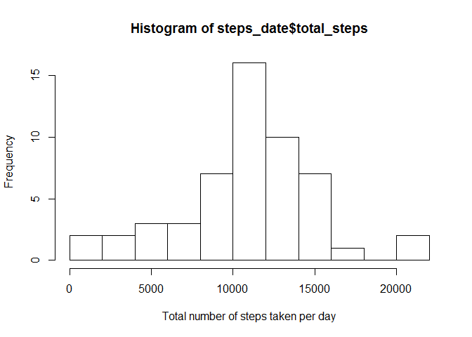
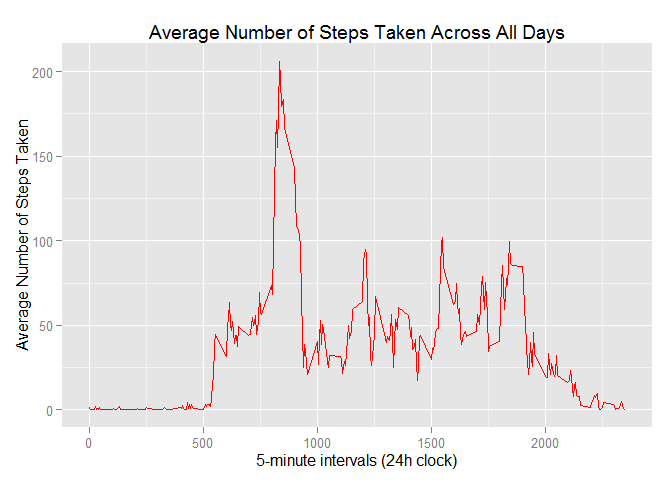
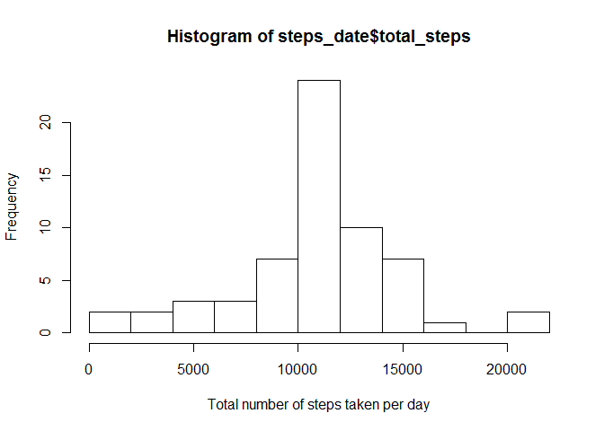

# Reproducible Research: Peer Assessment 1


## Loading and preprocessing the data
- Unzip and read the *activity.csv* file from working directory
- Convert date from character vector to a date vector

```r
library(dplyr)
```

```
## Warning: package 'dplyr' was built under R version 3.1.3
```

```
## 
## Attaching package: 'dplyr'
## 
## The following object is masked from 'package:stats':
## 
##     filter
## 
## The following objects are masked from 'package:base':
## 
##     intersect, setdiff, setequal, union
```

```r
data <- read.csv(unz("activity.zip", "activity.csv"), colClasses=c("numeric", "character", "numeric"))
## convert character to Date
data$date <- as.Date(data$date)
```


## What is mean total number of steps taken per day?

- Group steps by date variable
- Sum the step by 


```r
steps_date <- group_by(data, date) %>% summarise( total_steps=sum(steps))
```

Plot histogram of steps taken per day: 


```r
hist(steps_date$total_steps
     , breaks=15
     , xlab="Total number of steps taken per day")
```

 

Report mean and median: 

```r
mean(steps_date$total_steps, na.rm=TRUE)
```

```
## [1] 10766.19
```

```r
median(steps_date$total_steps, na.rm=TRUE)
```

```
## [1] 10765
```


## What is the average daily activity pattern?

```r
steps_interval <- 
    group_by(data, interval) %>% summarise( mean=mean(steps, na.rm=TRUE))

library(ggplot2)
```

```
## Warning: package 'ggplot2' was built under R version 3.1.3
```

```r
ggplot(steps_interval, aes(interval, mean)) + 
    geom_line(color = "red", size = 0.5) + 
    labs(title = "Average Number of Steps Taken Across All Days"
         , x = "5-minute intervals (24h clock)"
         , y = "Average Number of Steps Taken")
```

 

```r
steps_interval[which.max(steps_interval$mean), ]
```

```
## Source: local data frame [1 x 2]
## 
##   interval     mean
## 1      835 206.1698
```


## Imputing missing values

- Total number of NAs in the data 


```r
sum(is.na(data))
```

```
## [1] 2304
```

Replace all NA with with mean values


```r
newData <- data

for( i in  1:nrow(newData)  ) {
    interval <- newData$interval[i]

    # print(paste('interval', interval))
    
    if( is.na(newData$steps[i]) ) {
        #print(paste('before', newData$steps[i]))
        
        newData$steps[i] <- steps_interval[steps_interval$interval == interval, ]$mean
        
        #print(paste('after', newData$steps[i]))
        
    }
    
}

sum(is.na(newData))
```

```
## [1] 0
```

```r
steps_date <- group_by(newData, date) %>% summarise( total_steps=sum(steps))
hist(steps_date$total_steps
     , breaks=15
     , xlab="Total number of steps taken per day")
```

 


## Are there differences in activity patterns between weekdays and weekends?
